# ⚡ ROHAN CHIVATE ⚡

 

<h3><code>Rohan Chivate</code></h3>

<table border="0" cellpadding="0" cellspacing="0">
  <tr>
    <td valign="top" width="370" align="center">
      
    </td>
    <td valign="top" width="490" align="center">
      
    </td>
  </tr>
</table>

 

  

<!-- Quick Links / Connect -->

  
  
  

 

<!-- Collapsible Technical Details (Hidden by default to keep profile spotless) -->

  
<b>⚙️ System Architecture & Automation Telemetry</b>

   
  <blockquote>
    
<b>• Pure SVG Graphics:</b> Zero client-side scripts. All animations use native SMIL wipes and CSS keyframes that execute safely inside GitHub Markdown.

    
<b>• Tokenless Telemetry:</b> Automatically syncs contribution metrics and streaks from public GitHub calendar data.

    
<b>• Autonomous CI:</b> GitHub Actions workflow refreshes the heatmap SVG every day at <code>06:17 UTC</code> via <code>update-profile-art.yml</code>.

  </blockquote>
   
  

    
  

 

